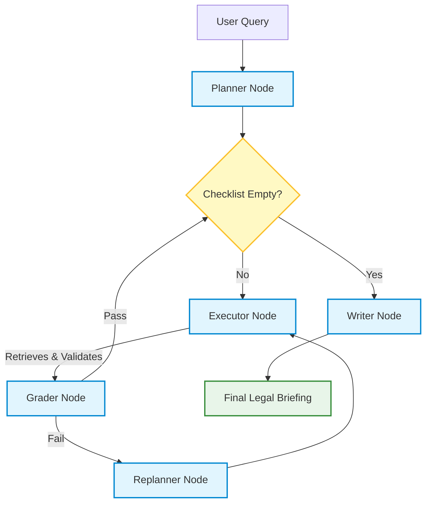

# ⚖️ Multi-Agent Legal RAG Framework

An enterprise-grade, fully local Retrieval-Augmented Generation (RAG) pipeline built with LangGraph. This system utilizes a multi-agent architecture to perform legal research, enforce strict data schemas via Pydantic, and synthesize factual briefings—all running locally with zero API costs.

## 🏗 Architecture & Data Flow

This project moves beyond standard linear RAG by implementing **Flow Engineering** and **Self-Healing Agentic Loops**. Each agent has a specialized duty and works in concert to execute a precise, coordinated strategy.

* **Planner Agent (The Strategist):** Dynamically breaks down complex user queries into a strict checklist of research micro-tasks.
* **Executor Agent (The Warrior):** Connects to the local ChromaDB vector store, retrieves relevant text chunks via `nomic-embed-text`, and surgically extracts data using `llama3`.
* **Pydantic Guardrails (The Shield):** Enforces a strict `LegalCitation` schema on the extracted data. If an LLM hallucinates or misses a required field, the Executor catches the `ValidationError` and triggers an internal self-correction loop.
* **Grader Agent (The Judge):** Acts as a semantic evaluator using the lightning-fast `phi3` model to validate the quality, factual accuracy, and relevance of the retrieved data against the original query.
* **Writer Agent (The Synthesizer):** Compiles the verified, grounded citations into a final, highly professional legal briefing.

### LangGraph Workflow



## ✨ Key Features

* **100% Local Execution:** Utilizes Ollama to run `llama3` and `phi3` entirely on local hardware, ensuring data privacy.
* **Deterministic Guardrails:** Uses LangChain's structured output and Pydantic to ensure the LLM output conforms to a strict JSON schema.
* **Enterprise Observability:** Fully instrumented with **LangSmith** to capture trace payloads, node latency, and flow-engineering loops.

## 🛠 Tech Stack

* **Orchestration:** LangGraph, LangChain
* **Local LLMs & Embeddings:** Ollama (`llama3`, `phi3`, `nomic-embed-text`)
* **Vector Database:** ChromaDB
* **Data Validation:** Pydantic
* **Observability:** LangSmith

## 🚀 How to Run Locally

### 1. Prerequisites

Ensure you have [Ollama](https://ollama.com/) installed and the following models pulled:

```bash
ollama pull llama3
ollama pull phi3
ollama pull nomic-embed-text

```

### 2. Environment Setup

```bash
python3 -m venv venv
source venv/bin/activate
pip install langgraph langchain langchain-community langchain-ollama langchain-chroma chromadb pydantic python-dotenv

```

### 3. Observability Configuration

Create a `.env` file in the root directory:

```env
LANGCHAIN_TRACING_V2=true
LANGCHAIN_PROJECT="Multi-Agent Legal RAG"
LANGCHAIN_API_KEY="your_langsmith_api_key_here"

```

### 4. Build the Vector Database

```bash
python ingest.py

```

### 5. Execute the Pipeline

```bash
python app.py

```

## 📊 Decoding LangSmith Traces

Once the pipeline executes, log into your LangSmith dashboard to review the run. You will observe the hierarchical execution flow from `Planner` to `Writer` and the `Executor` retry loops whenever Pydantic catches a schema validation failure.
