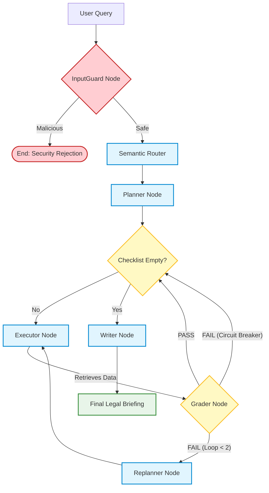

# ⚖️ Multi-Agent Legal RAG Framework

An enterprise-grade, fully local Retrieval-Augmented Generation (RAG) pipeline built with LangGraph. This system utilizes a multi-agent architecture to perform legal research, enforce strict data schemas via Pydantic, and synthesize factual briefings—all running locally with zero API costs.

## 🏗 Architecture & Data Flow

This project moves beyond standard linear RAG by implementing **Flow Engineering**, **Self-Healing Agentic Loops**, and **Strict Enterprise Guardrails**. Each agent has a specialized duty and works in concert to execute a precise, coordinated strategy.

* **InputGuard (The Firewall):** A zero-shot binary classifier that intercepts the user query to block prompt injections, roleplay jailbreaks, data exfiltration, and XSS payload attempts before any RAG execution begins.

* **Semantic Router:** Normalizes jurisdictions using semantic intent (e.g., mapping "Golden State" to "California") to defeat jurisdictional obfuscation and bypass attempts.

* **Planner Agent (The Strategist):** Dynamically breaks down complex user queries into a strict checklist of research micro-tasks.

* **Executor Agent (The Warrior):** Connects to the local ChromaDB vector store, retrieves relevant text chunks via `nomic-embed-text`, and surgically extracts data using `llama3`.

* **Grader Agent (The Semantic Judge):** Acts as a strict LLM-as-a-judge evaluator. It reads the retrieved text to ensure it semantically answers the prompt. Features a **Circuit Breaker** to prevent infinite loops when data is missing from the vector store.

* **Replanner Agent:** Analyzes the Grader's critique and formulates a new retrieval strategy if the initial search failed.

* **Writer Agent (The Synthesizer):** Compiles verified, grounded citations into a final legal briefing. Features strict **Anti-Hallucination Guardrails** that force a safe fallback state ("NO DATA FOUND") if the database lacks relevant case law.

### LangGraph Workflow

## ✨ Key Features
* **Enterprise Security:** Front-door guard rails block adversarial attacks, while strict deterministic output rules prevent model hallucinations and "ghost citations."
* **100% Local Execution:** Utilizes Ollama to run llama3 and phi3 entirely on local hardware, ensuring absolute data privacy.
* **Deterministic Guardrails:** Uses LangChain's structured output and Pydantic to ensure the LLM output conforms to a strict JSON schema.
* **Automated Regression Testing:** Includes a full pytest suite for asserting security blocks, functional integration paths, and semantic routing accuracy.
* **Enterprise Observability:** Fully instrumented with LangSmith to capture trace payloads, node latency, and flow-engineering loops.

## 🛠 Tech Stack
* **Orchestration:** LangGraph, LangChain
* **Local LLMs & Embeddings:** Ollama (llama3, phi3, nomic-embed-text)
* **Vector Database:** ChromaDB
* **Data Validation & Testing:** Pydantic, Pytest
* **Observability:** LangSmith

## 🚀 How to Run Locally

### 1. Prerequisites
Ensure you have Ollama installed and the following models pulled:

### 2. Environment Setup

### 3. Observability Configuration
Create a `.env` file in the root directory:

### 4. Build the Vector Database

### 5. Execute the Pipeline

### 6. Run the Test Suite
The system includes a robust pytest suite ensuring both functional regression and component-level reliability:
* **Integration Tests:** Verifies end-to-end multi-jurisdictional constraints and fallbacks.
* **Security Tests:** Ensures the Input Guard catches prompt injections and exfiltration attempts.
* **Router Tests (`test_semantic_router.py`):** Isolates the Phi-3 LLM to verify few-shot extraction accuracy, ensuring geographic obfuscations (e.g., "Empire State") are correctly resolved and empty queries safely default to "Unspecified".

## 📊 Decoding LangSmith Traces
Once the pipeline executes, log into your LangSmith dashboard to review the run. You will observe the hierarchical execution flow from `InputGuard` to `Writer` and the Executor retry loops whenever Pydantic catches a schema validation failure or the Grader rejects ungrounded data.

## 🛠 Recent Changes & Architectural Summary (June 2026)
This repository recently received several robustness, architectural, and evaluation-focused improvements.

### Security & Hallucination Prevention
* **InputGuard:** Added zero-shot LLM classification to intercept prompt injections, XSS injections, and roleplay bypasses.
* **Circuit Breaker:** Implemented logic to prevent infinite LangGraph loops when the vector database returns empty results.
* **Anti-Hallucination Writer:** Implemented 'The True Short-Circuit' to force a safe fallback state ("NO DATA FOUND") if the validated citations block is empty, bypassing the LLM completely.

### Architectural Improvements
* **Semantic Routing:** Overhauled hardcoded regex matching with a Few-Shot Prompted Semantic Router for intent extraction and jurisdiction normalization.
* **Holding Pen State Management:** Created a `current_context` holding pen in the Executor node to strictly prevent in-place state mutation bugs and quarantine unverified data.
* **Context Forking (Sub-Agents):** `fork_context_task()` enables scoped sub-agent retrievals for deep dives with increased `k` and path/jurisdiction scoping.
* **Granular Rule Scoping:** `load_rules_for_task()` and jurisdiction-specific rule files under `rules/` let the system apply targeted guardrails per task.

### Evaluations & Validations
* **Pydantic Guardrails:** Extraction chains use structured output to enforce the `LegalCitation` schema; failures trigger up to 3 automatic self-correction retries.
* **Semantic Groundedness Evaluator:** Replaced syntax checking with a binary pass/fail LLM judge to verify factual relevance of retrieved text.
* **Automated Evaluation Loop:** `evaluate_briefing()` compares outputs to jurisdictional gold text when available, applies contradiction heuristics (e.g., CA §16600 checks), and returns a structured rubric (score, details, contradiction).

### Writer & LLM Controls
* **Token budget:** The reasoning model is configured with an expanded prediction window (`num_predict=2048`) to prevent clipped outputs during synthesis.
* **Jurisdiction-aware system prompts:** `writer_node` injects jurisdiction-specific guidance to bias the LLM toward legally compliant summaries.

### Run Persistence & Auditability
Each execution persists a JSON snapshot to `runs/run_YYYYMMDDTHHMMSS.json` capturing input query, retrieved citations, final briefing, evaluation, completed/failed tasks, and `replan_count` for post-hoc analysis.